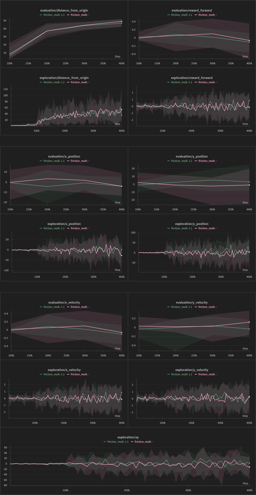
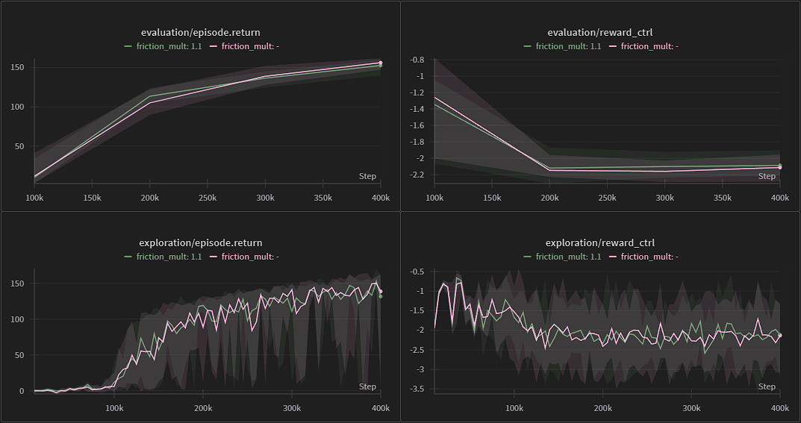
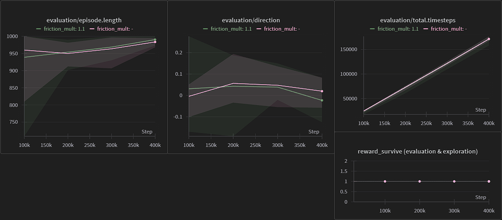
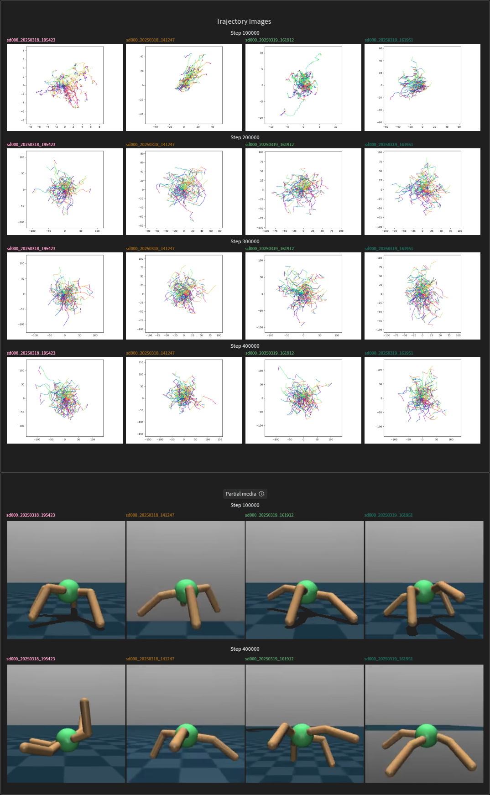
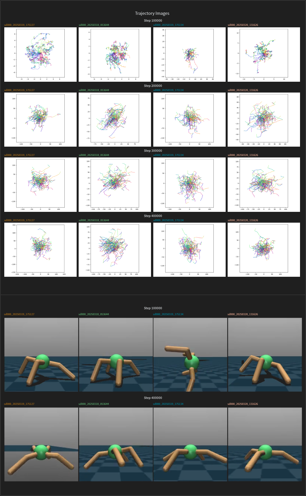
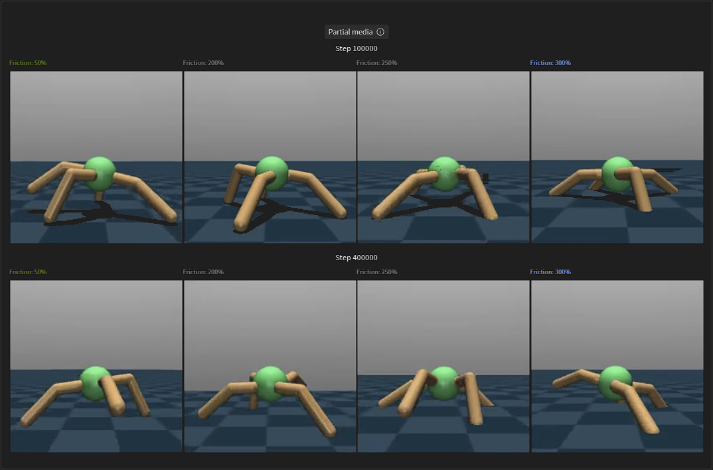

<style>
	a[href]>img[src^="./static"] {
		width: 100%;
	}
</style>

# Introduction

Train agents on MuJoCo environments using OGBench and optionally provide a multiplier to change the MuJoCo model's friction.

This uses a sparse checkout of [reference implementations from OGBench](https://github.com/seohongpark/ogbench/tree/master?tab=readme-ov-file#reference-implementations "github.com/seohongpark/ogbench") as a base.


## Installation

```bash
pip install -r requirements.txt
```
> compared to the original OGBench requirements, this has a downgraded *matplotlib* version due to an `AttributeError` with `FigureCanvasInterAgg` (see [here](https://github.com/RVC-Project/Retrieval-based-Voice-Conversion-WebUI/issues/2411 "GitHub Issue: \"AttributeError: 'FigureCanvasAgg' object has no attribute 'tostring_rgb'  #2411\""))


## Execution

Navigate to the directory and update `PYTHONPATH`:

```bash
cd data_gen_scripts/
export PYTHONPATH="../wrappers:../impls:${PYTHONPATH}"
```

and run the [OGBench command normally](https://github.com/seohongpark/ogbench/tree/master?tab=readme-ov-file#reproducing-expert-policies "github.com/seohongpark/ogbench"):

```bash
# run without editing friction:
python3 main_sac.py --train_steps=400000 --save_interval=400000

# run with 10% increased friction:
python3 main_sac.py --train_steps=400000 --save_interval=400000 --friction_mult=1.1
```
> run `python3 main_sac.py --help` for default values, notably [`--agent`](data_gen_scripts/main_sac.py#L46)


<br/>
<br/>


# Results

To roughly average out the randomness of the trained agents, ten SAC agents were trained with default and $10 \\%$ increased friction (multiplier $=\\,1.1$) respectively.

Check the [interactive result report](https://api.wandb.ai/links/jf-johs-luh/lvuvteaf "wandb.ai"), or alternatively the following preview:

---
---
<br/>

See [here](https://github.com/seohongpark/ogbench/blob/master/ogbench/online_locomotion/ant.py#L139 "GitHub > ogbench/online_locomotion/ant.py") for the *source* of (most of) the metrics.


## Comparison of Metrics

Agents were trained for $400\,000$ steps and evaluated for $50$ episodes every $100\,000$ steps.
Exploration was logged every $5\,000$ steps. The first $10\,000$ steps were seed steps.

Metrics for exploration are (sometimes) included in this report, as they provide a more granular look at the data.

Ten runs (i. e. agents) with the default and a $10 \%$ increased friction value respectively are grouped. The graphs (typically) show the mean and min/max of the corresponding values.


### Position & Velocity

<a href="https://wandb.ai/jf-johs-luh/OGBench_AntWalk/reports/AntEnv-Friction-Report--VmlldzoxMTg5ODE3OA?accessToken=a5qmx3cffmqjne5tttu230yyxmspttxwo6sv32ei9t0alh1jt6k8ip30t88qq4zq#position-&-velocity" title="View in W&B Report">
	 Position & Velocity"/>
</a>


### General Metrics

<a href="https://wandb.ai/jf-johs-luh/OGBench_AntWalk/reports/AntEnv-Friction-Report--VmlldzoxMTg5ODE3OA?accessToken=a5qmx3cffmqjne5tttu230yyxmspttxwo6sv32ei9t0alh1jt6k8ip30t88qq4zq#general-metrics" title="View in W&B Report">
	 General Metrics 1"/>
</a>

The `reward_survive` in particular is identical and `total.timesteps` lines up almost perfectly.

<a href="https://wandb.ai/jf-johs-luh/OGBench_AntWalk/reports/AntEnv-Friction-Report--VmlldzoxMTg5ODE3OA?accessToken=a5qmx3cffmqjne5tttu230yyxmspttxwo6sv32ei9t0alh1jt6k8ip30t88qq4zq#general-metrics" title="View in W&B Report">
	 General Metrics 2"/>
</a>


## Media

Images and videos regarding the four *best* agents (ranked by `evaluation/episode.return`) for default and increased friction values respectively. More specifically:
- images of x-y trajectories (from `xy` and `direction` from the evaluated `info`) during each evaluation
- videos for the first and last evaluation (steps $100\,000$ and $400\,000$ respectively)

How the media is created: [videos](https://github.com/seohongpark/ogbench/blob/master/impls/utils/log_utils.py#L116 "GitHub > ogbench/impls/utils/log_utils.py"), [images](https://github.com/seohongpark/ogbench/blob/master/data_gen_scripts/viz_utils.py#L21 "GitHub > ogbench/data_gen_scripts/viz_utils.py").


### Default Friction

<a href="https://wandb.ai/jf-johs-luh/OGBench_AntWalk/reports/AntEnv-Friction-Report--VmlldzoxMTg5ODE3OA?accessToken=a5qmx3cffmqjne5tttu230yyxmspttxwo6sv32ei9t0alh1jt6k8ip30t88qq4zq#default-friction" title="View in W&B Report">
	 Default Friction"/>
</a>


### Increased Friction

<a href="https://wandb.ai/jf-johs-luh/OGBench_AntWalk/reports/AntEnv-Friction-Report--VmlldzoxMTg5ODE3OA?accessToken=a5qmx3cffmqjne5tttu230yyxmspttxwo6sv32ei9t0alh1jt6k8ip30t88qq4zq#increased-friction" title="View in W&B Report">
	 Increased Friction"/>
</a>


## Issues

Changing the friction too much causes issues with the collision, as demonstrated below. These examples end at $300 \%$ (`friction_mult=3`) to demonstrate that the models still somewhat work, despite the drastically changed friction.

Nonetheless, the friction can be increased beyond that to break the model entirely.

<a href="https://wandb.ai/jf-johs-luh/OGBench_AntWalk/reports/AntEnv-Friction-Report--VmlldzoxMTg5ODE3OA?accessToken=a5qmx3cffmqjne5tttu230yyxmspttxwo6sv32ei9t0alh1jt6k8ip30t88qq4zq#issues" title="View in W&B Report">
	
</a>

<br/>

---
---

<br/>


# Acknowledgments

- [OGBench](https://github.com/seohongpark/ogbench) for the reference implementations which serve as the core.
